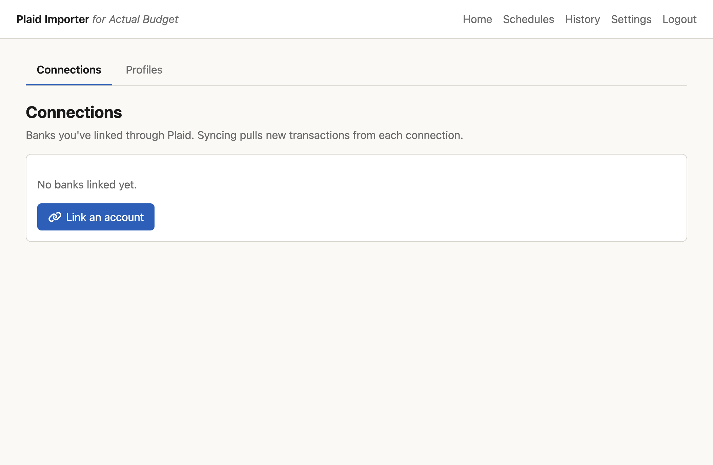
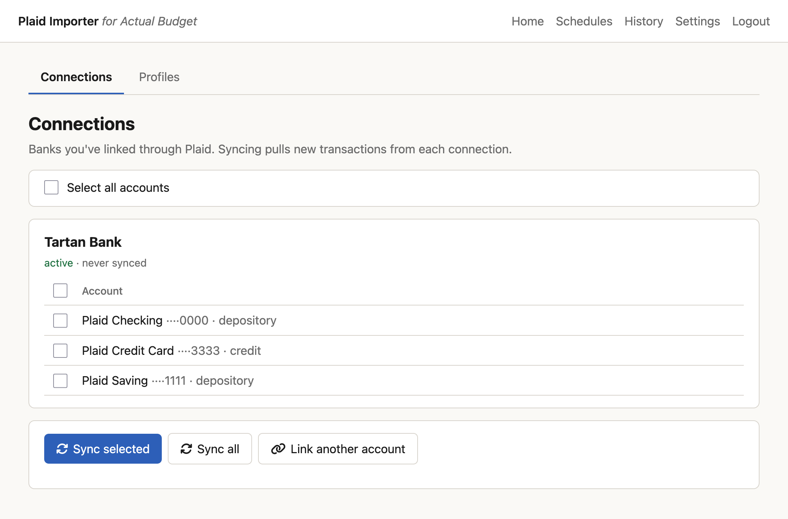
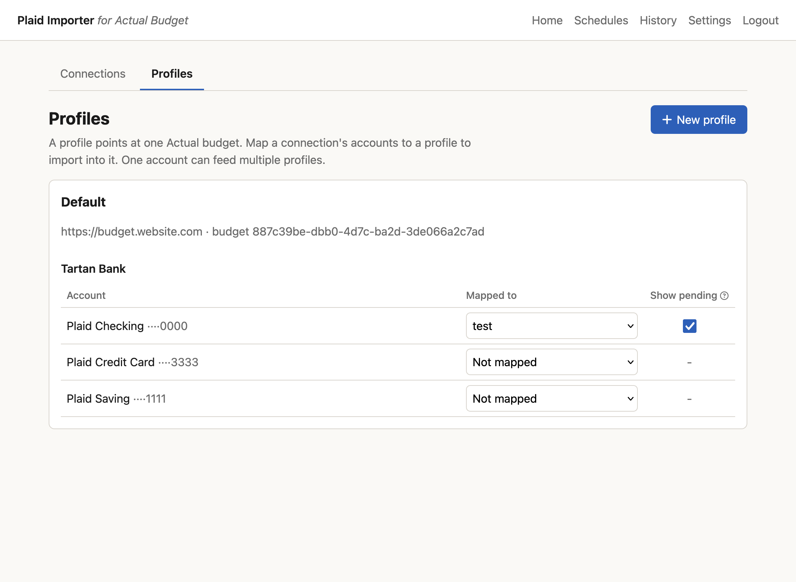
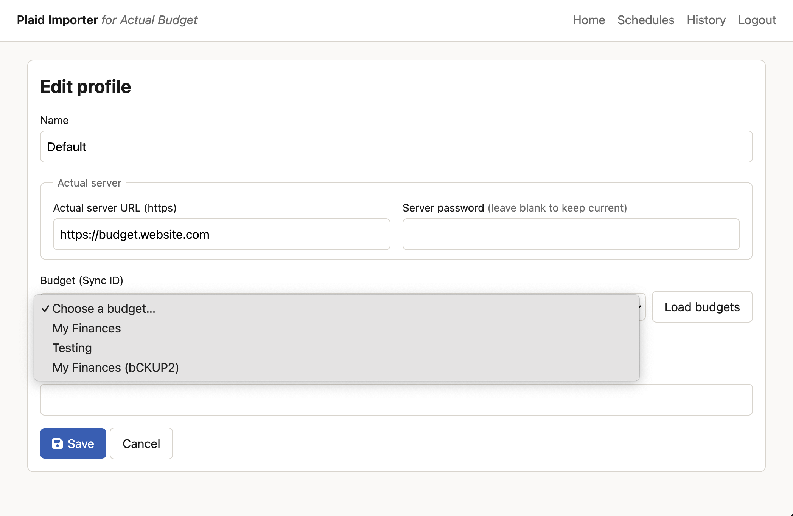
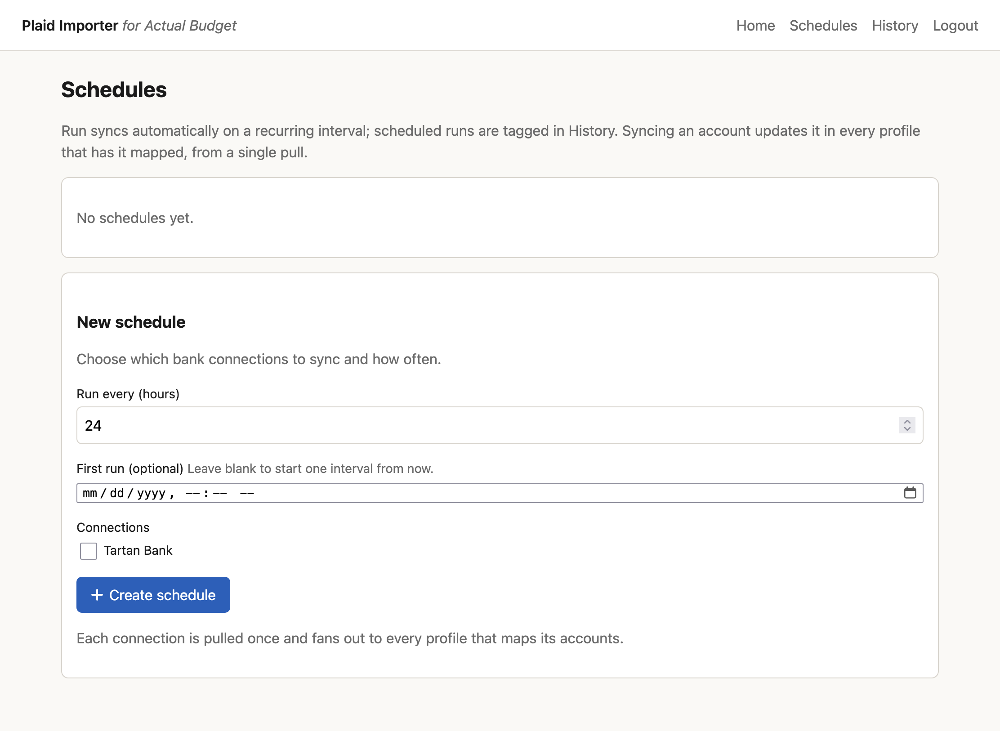

# Plaid Importer for Actual Budget

Self-hosted web app that pulls your bank transactions from
[Plaid](https://plaid.com/) into [Actual Budget](https://actualbudget.org/).

One Plaid pull per connection fans out to every budget that maps it, through a
local encrypted journal, so adding more budgets never costs more Plaid calls.
Full architecture, data model, and security notes:
**[How it works →](https://plop.jankbyrick.com/plaid-importer-mental-model.html)**

> **You bring your own Plaid credentials.** This app needs a Plaid `client_id` /
> `secret` with **production access** (Plaid's free tier is sandbox-only).
> Getting production access is between you and Plaid.
>
> **Serve it over HTTPS.** Plaid's OAuth banks require an HTTPS callback URL;
> without HTTPS only non-OAuth institutions can be linked. See [DEPLOY.md](DEPLOY.md).

## Features

- **At-a-glance dashboard**: the home page summarizes your connections, profiles,
  last sync, and next scheduled run, and flags any bank that needs re-linking.
- **Pending transactions**: set notes and categories on a pending transaction;
  they persist when it officially posts.
- **Multi-user**: built for a household. Family or roommates each get their own
  account, and per-profile Actual encryption keeps others out of your budget.
- **Multi-budget**: a "profile" points at one Actual budget; one bank account
  can feed several profiles at once.
- **Scheduled or on-demand**: pick which Plaid connections a schedule pulls and
  how often; run as many schedules as you need, or sync on demand.
- **Per-connection sync limits**: cap how often a connection can be pulled in a
  window. Plaid bills per pull, so you get a lever for family/friends. (A
  connection is one institution, e.g. Wells Fargo, which may hold several accounts.)
- **Connection lifecycle**: when a connection errors because you changed your
  bank credentials, re-link it without losing your setup.
- **Manage accounts**: add or drop which accounts a connection shares without
  re-linking. Dropped accounts stop syncing but keep their mappings; re-added
  ones are reconciled so you don't get duplicates.
- **Sync history**: see when you synced, how many items came through, and any
  failures.
- **Registration secret**: only people with the secret can register an account.
- **Admin controls**: the first account is admin and manages the registration
  secret, sync limits, and every profile.
- **Encryption**: Plaid tokens and profile secrets are encrypted at rest;
  transaction data is encrypted and short-lived.
- **Bilingual**: English and Spanish.
- **Unraid**: setup instructions in [DEPLOY.md](DEPLOY.md).

## Screenshots

## Set up

You need a Docker host, an Actual Budget server, and Plaid production credentials.

1. Copy `.env.example` to `.env` and fill it in: Plaid keys, your Actual server
   URL + password, and two generated secrets (commands are in the file).
2. Run the container (see [DEPLOY.md](DEPLOY.md)) behind an HTTPS reverse proxy.
3. Open the app and **register**; the first account becomes the admin.
4. **Link a bank** (Plaid), create a **profile** for your Actual budget, **map**
   each account to an Actual account, and click **Sync**, or set a schedule.

That's it. Migrations and first-run setup happen automatically on boot.

### Key settings (`.env`)

| Variable | What it does |
| --- | --- |
| `APP_URL` | Public HTTPS URL of the app (also the base of the Plaid OAuth redirect). |
| `PLAID_CLIENT_ID`, `PLAID_SECRET`, `PLAID_ENV` | Your Plaid credentials. Set `PLAID_ENV=production`. |
| `ACTUAL_SERVER_URL`, `ACTUAL_SERVER_PASSWORD` | Optional. Defaults the new profile form uses if you don't enter them (URL pre-filled; blank password falls back to this). Budgets are chosen per profile in the app. |
| `APP_USER`, `APP_PASSWORD` | Seed the first admin account. |
| `SESSION_SECRET` | Signs login cookies (`openssl rand -hex 32`). |
| `TOKEN_ENCRYPTION_KEY` | Encrypts Plaid tokens and profile secrets at rest (`openssl rand -base64 32`). Keep it stable; rotating it makes stored secrets unreadable. |

`APP_USER`/`APP_PASSWORD` are **seed-only**: on first boot they create your admin
account, then they're ignored. The `ACTUAL_*` values are optional defaults for
the New-profile form. Manage logins and budgets (profiles) in the app. Full list
with defaults is in [`.env.example`](.env.example).

## License

[AGPL-3.0](LICENSE). If you run a modified version as a network service, you
must offer its source to users.
